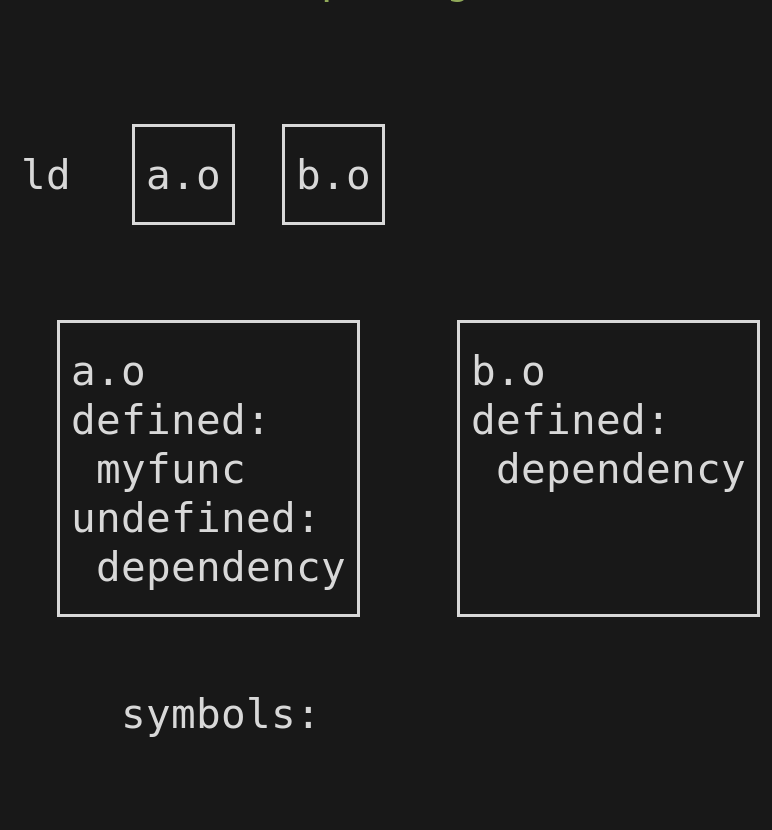

+++
title = "ELF Linking and Symbol Resolution"
date = "2025-06-09"
author = "Noratrieb"
tags = ["linking"]
keywords = ["elf", "linkage", "linkers"]
description = "A summary on how linkers resolve symbols on Unix-like platforms"
showFullContent = false
readingTime = true
hideComments = false
draft = false
+++

When you invoke `cargo build`, `make`, or any other native compilation, a lot of things happen.
First, the compiler reads and checks the source code, and then it emits native machine code optimized for the platform.
But after that, work isn't over.
A program consists of many different parts (compilation units, a file in C or a crate in Rust).
The compiler compiles each compilation unit individually.
After that, they have to be combined to form a full program.
This is the job of the linker, which links together the individual parts and any external libraries you use.

Linker behavior is specific to the binary format used by the platform, of which there are three[^xcoff] major ones in use today:
- ELF[^elf] (Linux, *BSD, Illumos, etc.)
- PE[^pe]/COFF[^coff] (Windows, UEFI)
- Mach-O[^macho] (Apple)

Today, we will take a closer look at ELF and how its linking process works.
The other platforms are similar in many ways, but different in some, which we will not get into.

## The Cast

Before we get to the linkage process itself, we need to define a few terms for the involved parts.

### Object File (`*.o`)

An object file, also called a "relocatable" file is the output of the compiler.
It contains all functions and data from a specific compilation unit, and references to undefined symbols that it imports.
It is one of the major inputs to a linker.

### Symbol

A symbol is the name of functions and data that the linker uses to resolve references between object files and libraries.
In C, the symbol of a function is just its name.
In C++ and Rust, the symbol for each function is "mangled" [^mangling] to account for namespaces and other language features.
Linkers treat the symbol just as an opaque name that must be unique between different functions.
An example symbol for a C++ function would be `_Z5emptyIlET_v`.

When you reference a function from a different compilation unit, the compiler will generate and undefined symbol reference to the symbol of the function.
The linker will then try to find a definition for it, and link it together.

### Static Library (`lib*.a`)

Also called "archives", they are the first kind of library.
Static libraries are, as the name implies, *statically* linked into the binary.
This means that code from static libraries will directly end up in the final binary.

A static library is just an `ar` (similar to `tar`) archive of object files.

### Dynamic Library (`lib*.so`)

Mainly called "shared library" in ELF, they are the opposite of static libraries.
If you link against a shared library, the code from the shared library will *not* end up in the final binary.
Instead, the shared library will be loaded at runtime startup, and the dynamic linker will resolve the references to its symbols there.
We will not go into dynamic linking and loading in this post,
but I can recommend [fasterthanlime's executable packer series](https://fasterthanli.me/series/making-our-own-executable-packer) if you want to know all about dynamic linking.

## The Linkage Process

The linker is configured via its command line arguments. Linkers support a very large amount of them, but we only care about the most important ones.

If you just pass an object file, this file will be read as part of the input to the linker: `ld hello.o`

To tell the linker to link against a library, you can use the `-l` argument: `ld hello.o -lz` will link against the `z` library.
The library is searched in the search path, which contains system libraries by default and can be extended by passing the `-L` flag:
`ld -L./my-libraries hello.o -lz`.

The linker will process its input files from start to end. It keeps a global table of all symbols, and whether they currently have a definition or not.
When an object file from the command line is read, all symbol definitions from the object file are added to the table.
If there were any previous undefined references to this symbol, they are now defined.
If there are any undefined symbols in the object file, they are added to the table as undefined.

Imagine we have a C object file `a.o` containing a definition for `myfunc` which references `dependency`
```c
void dependency();
void myfunc() {
    dependency();
}
```

and a second C object file `b.o` containing a definition for `dependency`:
```c
void dependency() {}
```

If we link them together with `ld a.o b.o`, the following will happen:



First, the linker will read `a.o`. It contains a symbol definition `myfunc`, which will be added as a definition to the symbol table.
It also contains an undefined symbol reference `dependency`, which is added to the symbol table as well.

Then, `b.o` is read. It contains a definition for `dependency`, so the symbol is set to be defined in `b.o`.

The linker can then create the output file, making sure that the reference that's part of `a.o` points to the corresponding code from `b.o` in the final binary.

### Linkage Order

While I mentioned that this happens from start to end, the order doesn't actually matter so far.
This changes when we get into libraries.

Libraries (both static and dynamic) behave similar to object files. They are read and their defined and undefined symbols are added to symbol table.
Except for libraries, the linker is lazy. If a library does *not satisfy any currently undefined symbols*, it's *not* read at all.

So for example, if instead of `b.o` we had `libb.a` linked in via `-lb`, the library would be linked in, as it can provide the `dependency` symbol.
But if we instead did `ld -lb a.o`, b would be skipped, and then `a.o` would be read, and the `dependency` symbol would be unsatisfied!

To get around this, we always need to ensure that we provide each library and object file before its dependencies, so passing the dependency tree in a preorder/topologically sorted order, if you're into that terminology.

There is a way to get around this, which is to use `--start-group` and `--end-group` [^group-flag].
The linker iterates through each group repeatedly until no more symbols are added, so `ld --start-group -lb a.o --end-group` will work.
The reason I bring this up is because the LLD linker wraps the entire command line into an implicit group, so you can't run into this problem when using it.
The default GNU ld linker[^bfd] does not do this, so there the order matters here.

As another example, we have the object file `main.o` which uses the library `curl`, which in turn uses on the library `ssl`.
We need to pass them as `ld main.o -lcurl -lssl` to ensure that every library is linked in.
`main.o` will have some undefined symbols that are provided by `curl`, so `curl` will be linked in, while `curl` will have some undefined symbols which are provided by `ssl`, so `ssl` will be linked in as well.
If we did it any other way around, a library would be skipped and not linked in, resulting in undefined symbols in the end, which causes the linker to error out.

### Static Libraries

Static libraries have an additional trick up their sleeves.
While the library itself is only read if it satisfies a symbol, the same also happens for _each object file_ in the archive.
If a library `liba.a` has two object files in it, `one.o` and `two.o`, and `one.o` defines a previously undefined symbol but `two.o` doesn't,
*only* `one.o` is actually read and linked in.
This once again requires that _every user_ of the library is linked _before_ the library, to ensure that every needed part of the library is pulled in.

### Duplicates and Weak Symbols

So far, the resolution for each individual symbol has been fairly straightforward. If you find a definition, you take it.
But what happens if there are multiple definitions?
The answer to that is an error, only one definition is allowed for each symbol.

At least, this is true for symbols coming from object files and static libraries.
A symbol can be defined in both an object file and a *shared library*, which is not an error.
In such cases, the definition in the object file wins, and the shared library loses.
There can even be multiple definitions in different shared libraries, where the first one will win.

To further control which symbol is picked (which can be used to implement a pattern where are able to provide a "default" value for a symbol), *weak symbols* can be used.
If a definition is marked as weak, it's okay if there is another definition that is not weak. In that case, the non-weak definition will win, no matter whether it's first or not.

While a non-weak symbol from an object file or static library overrides a weak symbol from an object file or static library, a non-weak symbol from a shared library does *not* override such a weak symbol.

If an object file references an undefined symbol that is marked as weak and no one else provides a definition for it, it will be set to zero instead of emitting an error.

Additionally, if there are multiple definitions but *all* of them are in a shared library, the definition from the first shared library will win, and there will not be any conflict error.

From this, we can arrive at this precedence order, where the first symbol definition in this order gets chosen by the linker:

1. normal symbol from object file or static library
1. weak symbol from object file or static library
1. normal or weak symbol from shared library (first one wins)

## Conclusion

ELF linkers use object files, static libraries, and dynamic libraries to create a binary as we know it.
To achieve this, it has to resolve references between the files, which are done via symbols.
There are many different rules for which symbol references resolve to which symbol definitions and depend on the type of file and symbol.

This should hopefully make it clearer what is happening under the hood with linkers, and maybe even help to debug linker errors in the future.
Linker errors are never fun, and every bit of knowledge helps there.

ELF linking and symbol resolution is a complex topic with many exceptions and special cases.
This post gave a general overview over it, but leaves many details untouched.
For more information on ELF linkers in general, [MaskRay's Blog](https://maskray.me/) is an invaluable resource with many very detailed posts.
About this topic,
I can especially recommend the posts about [Symbol Processing](https://maskray.me/blog/2021-06-20-symbol-processing) and [Weak Symbols](https://maskray.me/blog/2021-04-25-weak-symbol).

I can also always recommend experimenting with this yourself, or maybe even write your own linker. It's great!

[^elf]: **E**xecutable And **L**inkable **F**ormat, in case you were asking.
[^pe]: **P**ortable **E**xecutable, the format of `.exe` executable and `.dll` dynamic library files.
[^coff]: **C**ommon **O**bject **F**ile **F**ormat, the format of `.obj` object files.
[^macho]: Which gets its name from the Mach kernel, which Apple platforms are based on.
[^xcoff]: No IBM, I don't care about XCOFF, which is surprisingly still in use today the same way IBM AIX is still in use today.
          While we're doing a history lesson, there is also an "a.out" format that was used on older Unixes. It's the reason
          why ELF linkers still name their output file `a.out` if you don't override the name.
[^mangling]: If you want to learn how C++ mangles its names, I can recommend [my interactive website on this topic](https://noratrieb.github.io/womangling/).
[^bfd]: Also called `ld.bfd` if you want to be very precise.
[^group-flag]: The short-form flags are `-(` and `-)` respectively, which is pretty cute.
