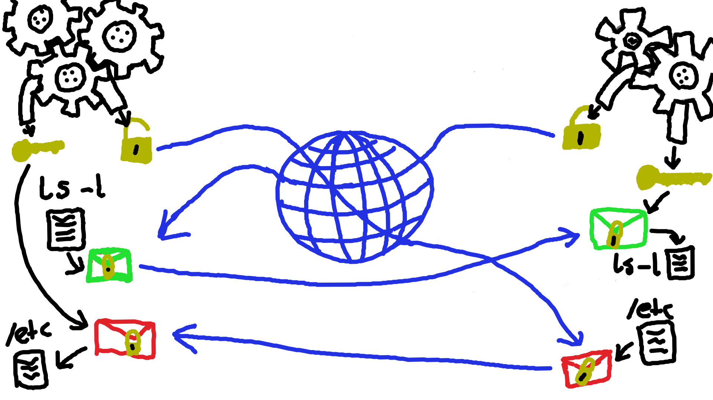

+++
title = "How SSH Secures Your Connection"
date = "2024-08-21"
author = "Noratrieb"
authorTwitter = "@Noratrieb"
tags = ["ssh", "security", "cryptography"]
keywords = ["box", "noalias"]
description = "Explaining SSH security by example"
showFullContent = false
readingTime = true
hideComments = false
draft = false
+++

If you've ever remotely connected to any UNIX-like server, you have likely used SSH, short for "Secure Shell".
SSH provides, as the name implies, secure shell access to remote machines and is used pretty much everywhere.
But what exactly does "secure" mean here, and how is this security provided by the protocol?
This post will take a look at SSH's security features and how they protect against example attacks.

## What is "secure" anyways?

Before we can start discussing how SSH protects against attacks, we first need to figure out what we are even protecting against, and which properties we need to ensure for that.
This is called a "threat model".

In our demonstration, we have the client, which we're gonna call Alice, and her server.
In addition to these two friendly parties, we have Eve.
Eve hates Alice and wants to cause chaos on her server.
Eve is the reason why Alice wants security here in the first place.

Alice has good reason to be suspicious of Eve.
Other than just hating Alice, Eve also has quite some power over Alice's networking connection, as she's a network administrator at the university where Alice is managing her server.
It is quite possible that Eve might abuse that power to not only inspect packets sent by Alice, but also change their contents if she wants to.

To protect against Eve, Alice wants to prevent Eve from doing three things:
- executing commands (which can obviously cause chaos)
- seeing the executed commands and their output (which may contain secrets)
- taking down the server (preventing Alice or others from using it)

This means that Alice need the following properties from our SSH connection:
- Confidentiality (Eve cannot see what is happening)
- Integrity (Eve can't mess with the connection - we will get more into why this is critical later)
- Availability (Eve cannot stop Alice from working on the server)
- Authentication (the server knows who Alice is (and who Alice isn't!) and can therefore determine if it can execute the commands)

Confidentiality, Integrity, and Availability form the "[CIA Triad](https://en.wikipedia.org/wiki/Information_security#Key_concepts)",
which doesn't have anything to do with the Central Intelligence Agency[^cia] and is at the heart of information security.
While authentication does fall under the triad as well, we keep it separate to be able to discuss it better.


We are going to go through building up SSH step-by-step to ensure these security properties.
The "base" we're starting from is a protocol where you can send a command to a server, which it will then execute and respond with the output.
This is obviously not secure, but is a shell, so we have the latter part already. Now let's add some security[^add-security]!

## Confidentiality through encryption

The solution to confidentiality is simple yet complicated: encryption.
We *simply* encrypt both the command and the output, which means that attackers cannot read it anymore.
Sadly encryption is also really complicated and hard to do securely, and very easy to do insecurely[^add-security-encryption].
We have two choices for the kind of encryption we're gonna use:

- symmetric (shared-secret) encryption
- asymmetric (public-key) encryption

With symmetric encryption the client and server know the same secret key and use that key to encrypt and decrypt the messages.

With asymmetric encryption the receiving party announces a public key to the world, which the sending party uses to encrypt data.
The private key is then used to decrypt that data.

Looking at this at a glance, it looks like we want asymmetric encryption, where both Alice and the server send their public key and then use that to encrypt the data.

Our exchange will look like this:

1. Alice generates a key pair and sends the public key
2. The server generates a key pair and sends the public key
3. They use the public keys to encrypt their messages and the private keys to decrypt them



Eve approves the security of this exchange. Because she can easily take it over!
She intercepts both public key messages and replaces the public key with her own.
Then, when either party sends a message, she intercepts that message, decrypts it, encrypts it with the actual public key of the peer, and sends it on.
She can see all traffic, we have totally lost confidentiality!

The problem here is that neither Alice nor her server can be sure that the used public key is the real one.
As Alice initiates the connection, it's good enough if only Alice knows that she's talking to the real server,
the server doesn't care about its peer (at least as far as this section is concerned. When we get to user authentication it does matter).

One way to fix this would be for Alice to store the server's public key and ensure it's the same next time.
She could even get that public key from the server's webserver[^use-https] or some other secure means.

Now Eve cannot insert herself into the middle, but she's still optimistic.
When Alice connects the next time, Eve will just store all messages, even if she can't decrypt them. They may be useful later.
And indeed, they are. A year later, Alice makes a fatal mistake when[^dumb-nixos-joke] migrating her server from Ubuntu to NixOS[^nixos-migration] and accidentally exposes the private key to the public.
Mistakes happen, and Alice quickly notices it and generates a new key before Eve can try to intercept anything.
But oh no, Eve did see the key and now she can go and decrypt *all* messages Alice has ever sent, that Eve stored so dilligently.
This is bad, we need to stop Eve from decrypting all these messages, or else a key leak would be catastrophic!
This property is called [forward secrecy](https://en.wikipedia.org/wiki/Forward_secrecy).
The way we ensure this is that we avoid using long-lived secrets like our previously established public key for encrypting messages.

So what we're gonna do now is go back to to our previous solution of having a key pair generated for every new connection, which we will use for encryption.
But how are we going to *authenticate* the server, to ensure Alice is talking to the real server and not to Eve?
We will keep using the public key from before, that worked quite well for ensuring authenticity, but we will not use it for encryption itself, but just to *sign* the encryption key.
So the server will use its long-lived private host key to sign the short-lived (ephemeral) public key, guaranteeing its authenticity.
Alice then verifies this signature and knows that she's talking to the real server.

But we have a performance problem, asymmetric operations are quite slow, so encrypting the entire connection with it is not going to be very fast.
Time to bring in symmetric encryption! Symmetric encryption algorithms like AES or ChaCha[^aes-chacha] are very fast, but they need a shared secret.
The easiest way to create a shared secret is a Diffie-Hellman key exchange.
In a Diffie-Hellman key exchange, both parties generate a public key and a private secret,
and then use the other party's public key combined with their private key to establish a shared secret.

We can't directly use the shared secret from the Diffie-Hellman key exchange as the encryption key.
This is because the shared secret is, for mathematical reasons, not uniformly random, meaning it's not just random-looking bytes.
But symmetric ciphers like AES require the secret to be uniformly random, meaning that it is indistinguishable from random data
(which is also true for the *output* of good symmetric ciphers).
Luckily there's a cryptographic tool for turning anything into uniformly random bytes: a hash function!
A hash function takes an arbitary amount of data and outputs a short (for SHA-256, 32 bytes[^sha256-len]) digest, which can be seen like a fingerprint of the data.
The important property we're interested in is that this digest is uniformly random, and can be used as a key.
SSH usually uses raw SHA-256, hashing the shared secret [and a few other things](https://datatracker.ietf.org/doc/html/rfc4253#section-7.2).
This process is called "Key Derivation".
Another popular solution for this is HKDF (HMAC Key Derivation Function), which is used by TLS, used to serve you this web page.
I hope you appreciate this web page.
HKDF is based on HMAC and essentially also boils down to a hash (also commonly SHA-256) with some sparkly extra bits that we won't worry about.

So our next version of the protocol looks like this:
1. Alice generates a Diffie-Hellman key and sends the public key
2. The server generates a Diffie-Hellman key and sends the public key
3. The server sends the a signature of the shared secret with its long-lived key
4. Alice verifies that the signature is correct
5. They can send messages encrypted using a symmetric cipher and the derived shared secret

This is a lot better.

Before further securing our connection, we're gonna go on a small tangent regarding encryption algorithm selection.

### Protecting against downgrade attacks

Previously, we mentioned that a secure encryption algorithm would be used, but didn't mention how this algorithm is selected.
SSH (version 2, which is what everyone uses) dates back to 2006. The algorithms used today are more recent than that.
The reason this can be done is that SSH contains *algorithm negotation*.
Before doing the actual key exchange, both parties send a message of their supported algorithms for the encryption cipher, the key exchange method (Diffie-Hellman), and the host key signature algorithm.
Both parties then take the list of supported algorithms and determine which one to use.
Since it's so old, SSH supports some ciphers that are not considered secure today, like 3DES or even RC4[^rc4-deprecation].
Alice might also have reasons to not use specific modern ciphers.
For example, if she really cares about this data remaining secret for 50 years, she might prefer not using AES-128 (even though that is totally secure today, and is in fact used to serve you this web page) as it is not quantum-resistant.
If she *really* cares about this, she should disable support for it in her configuration, but we want to remain secure even if she forgets this.

Alice's server does support and prefer the latest and greatest ciphers... but what if Eve tricked Alice into believing it didn't support them?
When the server sends its list of supported algorithms, Eve modifies this to only contain 3DES (or some other undesriable cipher).
When Alice's client advertises her supported ciphers to the server, Eve again modifies it to only contain 3DES.
Now both the server and the client think that the peer only supports 3DES, and select 3DES[^3des-sshd], which is not what Alice would want!
This is called a "downgrade attack", as it downgrades the good security into bad security that can be exploited by Eve.

We want to protect against this. A downgrade attack can be stopped if either side notices that an algorithm support list message has been tampered with.
The server could authenticate its message to let the client check it.
We already have a way for the server to authenticate something: the host key signature!
So what SSH does is that it takes the entire algorithm negotation message that it sent to the client, and also the one it received from the client, and includes that in the signature as well.
It hashes the messages, the shared secret and a few extra things and then signs the hash.
When the client goes on to verify the signature, it also collects the algorithm negotation message it received from the server and the one it sent to the server and includes that in its hash.
Only if the signed hash matches its own hash does it continue.
This means that if Eve tampers with either message, the server and client will disagree on the contents of that message, which means that the hash will differ, so the signature will be invalid.
The server doesn't check this itself and relies on the client to notice any issues here.

This entire encryption scheme is good at keeping the data secret, but we are still missing something to make the connection actually secure...

## Integrity through MAC

While the communication is now encrypted, it's not secure from tampering.
To understand more precisely what that would look like and even execute a concrete attack, we first need to understand how symmetric encryption actually works.
A cipher can either be a block cipher or a stream cipher. A block cipher splits the message into many blocks (for example, of 16 bytes)
and then encrypts one block after the other. AES is a block cipher.

You need a *mode of operation* for this, which describes how exactly the blocks are encrypted.
The most popular mode of operation of AES these days is Counter Mode (CTR) (or rather, it's better sibling Galois Counter Mode (GCM), which we will get to later).
Counter mode doesn't actually encrypt the message in blocks, it just encrypts a number, the counter, for every block.
The resulting ciphertext can then be used as the keystream for a *stream cipher*.

A stream cipher uses a stream of random-looking bytes (the keystream) that are then XORed with the plaintext to get the ciphertext.
An example for a stream cipher is ChaCha (which is inherently a stream cipher, and not just a block cipher in counter mode).
When decrypting, the receiver generates the same keystream and XORs the ciphertext with get, getting back the plaintext.
This takes advantage of XORs reversibility.

Now that Eve knows this too, she wants to execute an attack against Alice, who's using a stream cipher to encrypt her commands.

Eve knows that Alice really likes executing `ls -l` on her server[^ls-l].
In our example, Alice is using ChaCha20 (the number stands for the number of rounds, which is configurable for ChaCha) with some key that is unknown to Eve and you[^recover-the-key].
But what Eve does see is the ciphertext, which is `7a1f7b420f52102640f4`. Since she knows that Alice frequently executes `ls -l`, she assumes that this is `ls -l` of some directory.
Eve loves chaos, so she would like to instead delete the directory using `rm -r`.
As we've seen before, the plaintext is obtained by XORing the ciphertext with the key stream.
This means that if we flip a bit in the ciphertext, it will get flipped in the plaintext too!
Since `ls -l` and `rm -r` have the same length, we just need to flip the `l`s into `r`s and the `s` into an `m`.
Assuming ASCII/UTF-8 encoding, we get the following values for the characters.

`l=6C`, `s=73`, `r=72`, `m=6d`

Eve uses this to determine which bits she needs to flip, the masks `f1` and `f2` (which are computed as the XOR of both letters).

```
l =0110 1100
r =0111 0010
f1=0001 1110

s =0111 0011
m =0110 1101
f2=0001 1110
```

Eve then uses `f1` to flip the bits for the first and fifth byte and flips the second byte using `f2`.
This results in the ciphertext `64017b421152102640f4`. Eve passes the message to the server, which then decrypts it to... `rm -r /etc`!
Very bad, all of Alice's `/etc` has just been deleted!
So despite not being able to *decrypt* the ciphertext, Eve was able to use her knowledge of what it *might* be to tamper with it, causing her command to be executed.
Check out [the Rust code implementing this](https://gist.github.com/Noratrieb/6dce2965ef010bae50c3a5fa8132a8fa).

We need to ensure this doesn't happen.

The way to do this is to use a Message Authenticate Code (MAC).
The MAC is a hash of the message, but also includes the shared key in the hashed content, so that Eve can't just re-create the hash after tampering.
HMAC is the most popular algorithm for this, so we're gonna use it with some cryptographic hash like SHA-256.
After encrypting the message, we run HMAC over the message and the key and get back a hash, which we put at the end of the message.
The receiver then first computes the hash themselves and only when it matches do they decrypt the message.

This works fine, but these days it's used less commonly.
The state-of-the-art encryption uses so called "AEADs", which stands for "Authenticated Encryption with Associated Data".
With an AEAD, you don't need to check your own MAC, as creating and verifiying the MAC is part of the encryption process directly, which simplifies usage.
The two AEADs used in SSH (and TLS) are AES-GCM (which is AES in Galois Counter Mode, so the Counter Mode we described previously except it also includes a hash as the MAC)
and ChaCha20Poly1305 (which is ChaCha20 with a MAC generated by the Poly1305 hash algorithm).

We now have a fully encrypted and authenticated (authenticate here refers to message authentication, so the resistance from tampering. It is unrelated to user authentication)
stream to send our commands, leaving us to implement the last part of this handled by SSH:

## User authentication through passwords and public keys

While it's very cool that Eve cannot use Alice's connection, it's also quite pointless when Eve can just log into the server herself directly.
We need to stop Eve from doing that.

SSH offers several ways to authenticate users, the most common ones being password and public key.

The password login is very simple. Alice sends her password to the server, the server verifies it the same it would if she logged in physically, and then grants her access or not.
For this, it's very important that we have our encrypted connection, because if we transmitted the password in plaintext, Eve could just read it and use it herself.
Password authentication also reveals the password to the server, which could be bad in case Eve manages to take over the server somehow.
Then Alice would be telling her password, which she might be using in other places as well if she's not using a password manager[^password-manager], directly to Eve.
In addition to this downside, the usability of passwords is also very bad, as they need to be entered every time, which is annoying.

This is all solved by public key authentication.
Alice has a private key and a public key, the public key is stored on the server, and she then uses this key to sign something to the server,
which proves that she's Alice.
This is very similar to what we had earlier in the key exchange when proving that the server really is who they claim they are.
Here (and for the server earlier too) it is very important that Alice needs to sign something different every time, because if she had to sign the same message every time, Eve could just intercept the signature the first time and then just send that again to pretend she's Alice (this is called a replay attack).
SSH ensures this by signing, among other things, the "session ID", a bunch of random bytes exchanged at the start of the connection.

## Availability through hope

The last piece in our security puzzle is availability. Eve likes causing chaos, and taking down a server sure is a lot of chaos.
We need to prevent Eve from being to execute a Denial of Service attack that would stop the server from doing work.
The SSH protocol itself does not handle this.

The main attack vector here is the key exchange.
By just sending its Diffie-Hellman public key, the client can get the server to do an expensive key exchange computation without doing any computation itself.
If a client does this many times, it can take up quite some resources from the server.

While the core protocol doesn't have anything to protect against this, SSH implementations do.
For example, OpenSSH has the `MaxStartups` configuration (defaulting to 10), which limits the amount of connections to ensure that there aren't too many key exchanges going on at the same time.
While this can save resources, it can also be used to block Alice from logging into her own server if Eve fills up this limit.

I tried executing such an attack on my own server using a [custom tool](https://github.com/Noratrieb/ssh/tree/9b49e099834aa7811663206c12f9cd6f5f3a050d/sshdos) and was able to get up CPU usage quite high and even block a few login attempts.
Not quite enough for a proper DoS, but the attack can probably be improved with more dedication than I was willing to put in for this post.

If this becomes a problem for Alice, the best solution to protect against Eve is to change the firewall to only allow access from certain IPs that are used by Alice, blocking out all of Eve's IPs in the process.
She could also use a VPN solution like Wireguard to only connect to the server via the VPN and never expose SSH publically.

It must be said that in our concrete scenario, Eve could just choose to drop all of Alice's SSH packets, preventing her from accessing the server and totally compromising availability.
There is nothing she can do do prevent that, other than calling up university support and try to get it resolved there, which would probably result in Eve getting fired.

## everything is fine

And just like that, everything is fine. We hope so, at least.

Our final flow works like this:
1. Alice opens a connection, sending her Diffie-Hellman public key
2. The server responds with its Diffie-Hellman public key and a signature with its host key
3. Alice verifies the signature with the public key she knows from the server
4. Alice then signs the connection with her public key
5. The server verifies the signature and public key with the list of known public keys for Alice
6. Alice can now securely execute commands and get the output

Real SSH involves a few extra messages, like negotiating which algorithms to use and more control over the specifics of the connection.

There are a few examples of things that could go wrong, even now:
- Our cryptographic algorithms may not be secure.
  If there's a fundamental weakness in the key exchange algorithm, the host key signing algorithm, or the encryption algorithm, then Eve may be able to exploit that link in the chain and get access.
  The connection is only secure if **everything** works perfectly.
  Modern OpenSSH connections use curve25519 for the key exchange (or even sntrup761x25519, which is secure against quantum computers),
  ed25519 for the host key signing and ChaCha20Poly1305 or AES256-GCM for the encryption.
  All of these are considered secure today, but that could always change in the future (especially with quantum computers, which can break curve25519, ed25519, and AES128).
- Eve might get information from the timing of messages and analyzing the amount of traffic.
  By looking at how much traffic is sent and when it is sent,
  Eve might be able to infer certain properties of the connection, for example which commands Alice might be executing.
  This is partially mitigated by encrypting the length of the packet,
  sending random ignored messages and a bit of random padding in every message.
- Bad key management on any side. If the long-lived host key or Alice's private key are exposed, Eve could use that to intercept the messages or pretend she's Alice.

And with that, I wish you happy and secure remote code execution!

## Further reading

If you want to know more about this topic, I can recommend the following resources:
- [RFC 4251 SSH Architecture](https://datatracker.ietf.org/doc/html/rfc4251#autoid-14) contains a lot of security considerations
- Computerphile's videos on cryptography with Mike Pound, for example
  - [AES](https://www.youtube.com/watch?v=O4xNJsjtN6E)
  - [Modes of Operation](https://www.youtube.com/watch?v=Rk0NIQfEXBA)
  - [AES-GCM](https://www.youtube.com/watch?v=-fpVv_T4xwA)
  - [Key Exchange](https://www.youtube.com/watch?v=vsXMMT2CqqE)
  - [Diffie-Hellman](https://www.youtube.com/watch?v=NmM9HA2MQGI)
  - [Elliptic Curves](https://www.youtube.com/watch?v=NF1pwjL9-DE)
  - [HMAC](https://www.youtube.com/watch?v=wlSG3pEiQdc)
  - [Digital Signatures](https://www.youtube.com/watch?v=s22eJ1eVLTU)

[^cia]: But I'm sure they like breaking it.
[^add-security]: I like using the phrase "add security" jokingly to refer to systems that use security-adjacent things but don't actually gain any security from it.
      But it doesn't apply here, we're gonna do serious security!
[^add-security-encryption]: Which is often the source of the afformentioned "add security" jokes.
[^use-https]: I'm not even gonna mention that the website would need to be secured using HTTPS.
              You're using HTTPS, right? At least when visiting this web page, you must be, as this server does not support HTTP.
              Try it via curl!
[^dumb-nixos-joke]: Some might even say *of*.
[^nixos-migration]: Something I've done myself recently. The migrating part, that is. I didn't leak the key, I think.
[^aes-chacha]: And there's no real reason to use anything other than AES or ChaCha these days, really.
      The latest version of TLS, which is what secures HTTPS, only allows these two to be used.
      OpenSSH, the most popular SSH server implementation, will also only advertise these two ciphers.
[^sha256-len]: Which is why it's called SHA-256, 256 bits. Can you guess the output size of SHA-512 or SHA-1[^sha1-len]?
[^rc4-deprecation]: RC4 has been officially deprecated in [RFC 4253](https://datatracker.ietf.org/doc/html/rfc8758) from being used in SSH,
                    but we don't want to rely on clients not supporting old ciphers to prevent these attacks.
                    For example, maybe a client really needs support to connect to some ancient less critical server.
[^3des-sshd]: If I try this on my local machine, my OpenSSH server immediately disconnects me as it refuses to use 3DES :).
[^ls-l]: Who doesn't?
[^recover-the-key]: It's not a very random key, you might be able to figure it out. If you do figure out out you get a cookie!
[^password-manager]: Which she really should.
[^sha1-len]: SHA-1 has an output size of 160 bits. The 1 in its name refers to the generation, it was the first Secure Hash Algorithm (by the NSA).
             SHA-256 is actually a form of [SHA-2](https://en.wikipedia.org/wiki/SHA-2). As SHA-2 has different output sizes, the output size is used in the name.
             [SHA-3](https://en.wikipedia.org/wiki/SHA-3) is then again commonly named after the generation.
